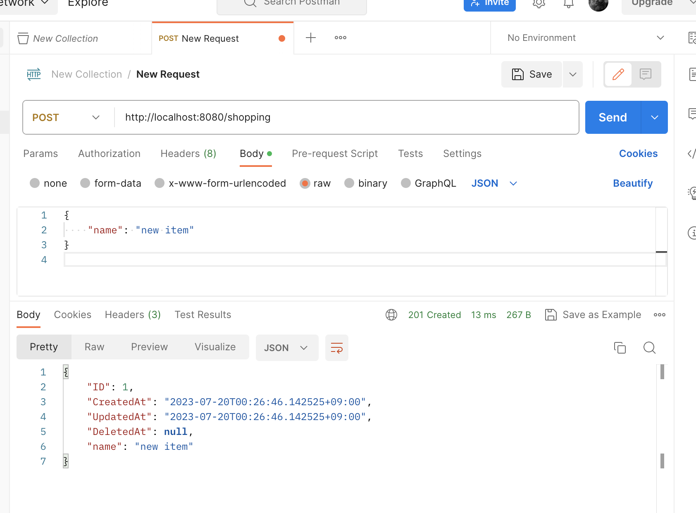
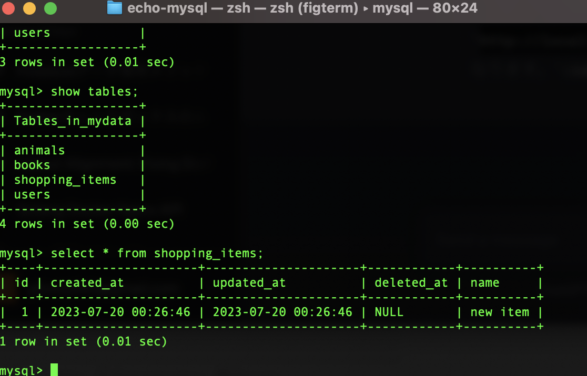
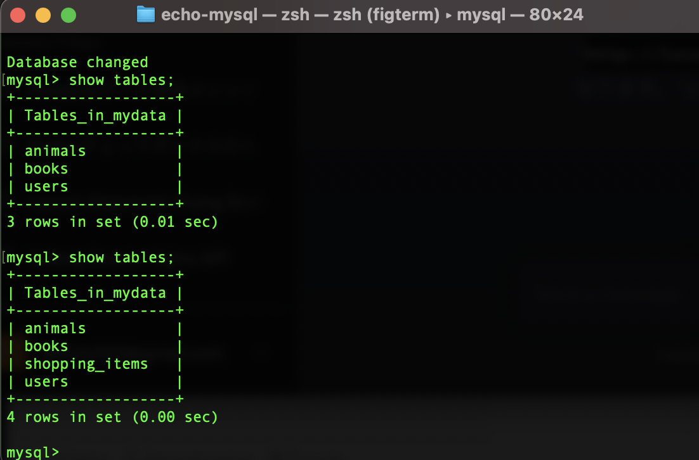

# EchoとMySQLでREST APIを作る
HTTP通信をするときのエンドポイント

GET
http://localhost:8080/shopping
http://localhost:8080/shopping/2

POST
http://localhost:8080/shopping

PUT
http://localhost:8080/shopping/2

DELETE
http://localhost:8080/shopping/2

## 🖼️スクリーンショット
POST MANを使用して、HTTP通信をおこなっています。
</img>
</img>
</img>

全体のコード
```go
package main

import (
	"net/http"
	"strconv"

	"github.com/jinzhu/gorm"
	"github.com/labstack/echo/v4"
	_ "github.com/jinzhu/gorm/dialects/mysql"
)
// ShoppingItemは、買い物リストの構造体です。
type ShoppingItem struct {
	gorm.Model
	Name string `json:"name"`
}
// DBは、データベースのインスタンスです。
var DB *gorm.DB

// initは、データベースの初期化を行います。
func init() {
	// DBの初期化
	db, err := gorm.Open("mysql", "root:1234@/MyData?charset=utf8&parseTime=True&loc=Local")
	if err != nil {
		// エラー処理
		panic("failed to connect database")
	}
	// マイグレーション
	db.AutoMigrate(&ShoppingItem{})
	DB = db
}

func main() {
	// Echoのインスタンス作成
	e := echo.New()
  // ミドルウェアの設定
	e.POST("/shopping", createItem)
	e.GET("/shopping", getAllItems) // Add this line
	e.GET("/shopping/:id", getItem)
	e.PUT("/shopping/:id", updateItem)
	e.DELETE("/shopping/:id", deleteItem)
  // サーバー起動
	e.Start(":8080")
}

// MySQLにデータを追加
func createItem(c echo.Context) error {
	item := new(ShoppingItem)
	if err := c.Bind(item); err != nil {
		return err
	}
	DB.Create(&item)
	return c.JSON(http.StatusCreated, item)
}

// MySQLからデータを全て取得
func getAllItems(c echo.Context) error {
	items := []ShoppingItem{}
	DB.Find(&items)
	return c.JSON(http.StatusOK, items)
}

// MySQLからデータを1つ取得
func getItem(c echo.Context) error {
	id, _ := strconv.Atoi(c.Param("id"))
	item := new(ShoppingItem)
	if DB.First(&item, id).RecordNotFound() {
		return echo.NewHTTPError(http.StatusNotFound, "Item not found")
	}
	return c.JSON(http.StatusOK, item)
}

// MySQLのデータを更新
func updateItem(c echo.Context) error {
	id, _ := strconv.Atoi(c.Param("id"))
	newItem := new(ShoppingItem)
	if err := c.Bind(newItem); err != nil {
		return err
	}
	oldItem := new(ShoppingItem)
	DB.First(oldItem, id)
	oldItem.Name = newItem.Name
	DB.Save(oldItem)
	return c.JSON(http.StatusOK, oldItem)
}

// MySQLのデータを削除
func deleteItem(c echo.Context) error {
	id, _ := strconv.Atoi(c.Param("id"))
	item := new(ShoppingItem)
	DB.First(&item, id)
	DB.Delete(item)
	return c.NoContent(http.StatusNoContent)
}
```

## HTMLを表示するページを追加
http://localhost:8080/hello

```go
package main

import (
	"net/http"
	"strconv"

	"github.com/jinzhu/gorm"
	"github.com/labstack/echo/v4"
	_ "github.com/jinzhu/gorm/dialects/mysql"
)

// ShoppingItemは、買い物リストの構造体です。
type ShoppingItem struct {
	gorm.Model
	Name string `json:"name"`
}

// DBは、データベースのインスタンスです。
var DB *gorm.DB

// initは、データベースの初期化を行います。
func init() {
	// DBの初期化
	db, err := gorm.Open("mysql", "root:1234@/MyData?charset=utf8&parseTime=True&loc=Local")
	if err != nil {
		// エラー処理
		panic("failed to connect database")
	}
	// マイグレーション
	db.AutoMigrate(&ShoppingItem{})
	DB = db
}

func main() {
	// Echoのインスタンス作成
	e := echo.New()
	// ミドルウェアの設定
	e.POST("/shopping", createItem)
	e.GET("/shopping", getAllItems) // Add this line
	e.GET("/shopping/:id", getItem)
	e.PUT("/shopping/:id", updateItem)
	e.DELETE("/shopping/:id", deleteItem)
	// /helloのURLにアクセスしたら、Hello GolangというHTMLを返す
	e.GET("/hello", getGreet)
	// サーバー起動
	e.Start(":8080")
}

// getGreetは、/helloのURLにアクセスした際にHello GolangというHTMLを返します。
func getGreet(c echo.Context) error {
	html := "<html><body><h1>Hello Golang</h1></body></html>"
	return c.HTML(http.StatusOK, html)
}

// MySQLにデータを追加
func createItem(c echo.Context) error {
	item := new(ShoppingItem)
	if err := c.Bind(item); err != nil {
		return err
	}
	DB.Create(&item)
	return c.JSON(http.StatusCreated, item)
}

// MySQLからデータを全て取得
func getAllItems(c echo.Context) error {
	items := []ShoppingItem{}
	DB.Find(&items)
	return c.JSON(http.StatusOK, items)
}

// MySQLからデータを1つ取得
func getItem(c echo.Context) error {
	id, _ := strconv.Atoi(c.Param("id"))
	item := new(ShoppingItem)
	if DB.First(&item, id).RecordNotFound() {
		return echo.NewHTTPError(http.StatusNotFound, "Item not found")
	}
	return c.JSON(http.StatusOK, item)
}

// MySQLのデータを更新
func updateItem(c echo.Context) error {
	id, _ := strconv.Atoi(c.Param("id"))
	newItem := new(ShoppingItem)
	if err := c.Bind(newItem); err != nil {
		return err
	}
	oldItem := new(ShoppingItem)
	DB.First(oldItem, id)
	oldItem.Name = newItem.Name
	DB.Save(oldItem)
	return c.JSON(http.StatusOK, oldItem)
}

// MySQLのデータを削除
func deleteItem(c echo.Context) error {
	id, _ := strconv.Atoi(c.Param("id"))
	item := new(ShoppingItem)
	DB.First(&item, id)
	DB.Delete(item)
	return c.NoContent(http.StatusNoContent)
}
```